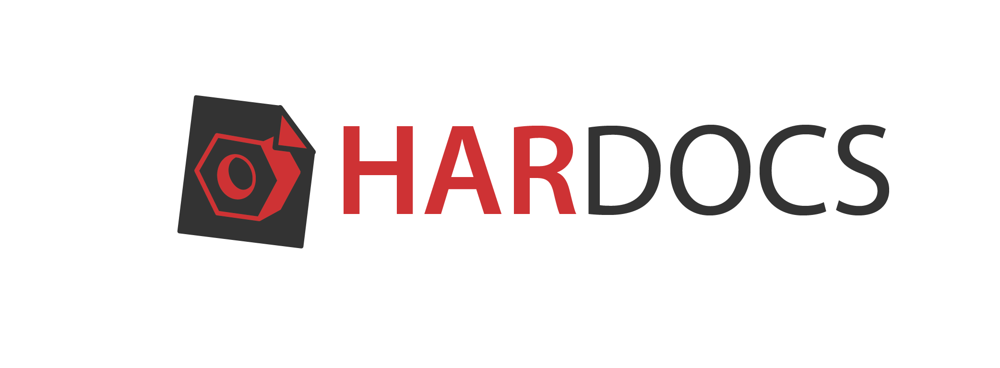

# Intro to hardocs

# Attention this documentation is deprecated, to know more about hardocs current status, go to [hardocs.github.io](https://hardocs.github.io)

Hardocs is a package to make hardware documentation more user friendly and intuitive. Hardware related documentation and information should be compliant with the following [FAIR DATA principles](https://www.force11.org/group/fairgroup/fairprinciples):

- To be Findable
- To be Accessible
- To be Interoperable
- To be Reusable

## Package features

- Simple command lines.
- Mardown centered.
- Simple static site generation with vuepress.
- Custom vue components to display youtube videos.

[npm package](https://www.npmjs.com/package/hardocs)

## The need for a better hardware documentation

A hardware project composed of different assets and digital objects that represent different things like, parts, part relations, part models and assembly models. It also involves handling data about part supply, quantities, bill of materials, etc. Furthermore a hardware project always requires some sort of documentation that explain how to use the source files, the current version of the project, etc.

Maintaining and developing a documentation package can be tedious. We need a solution that progressively allows users to create such documentation and easily harvest data about their project in an intuitive way.
